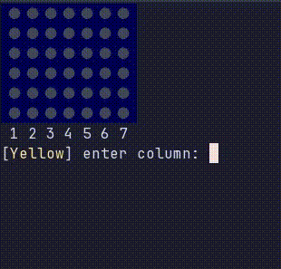

# Connect Four
A CLI-based Connect Four game written in pure Go.
It has a clean, beautiful board complete with a working input and win detection system, all in your terminal.




## Installation
### Using ```go``` (Recommended)
> [!NOTE]
> requires ```go 1.25.7+```
```zsh
go install github.com/QLight-dev/connect-four
connect-four
```
## License
MIT © Muhammed Uzair
